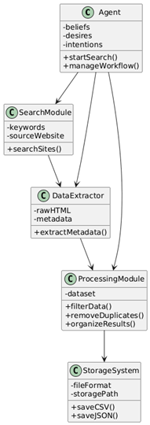
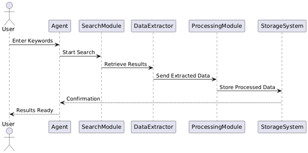
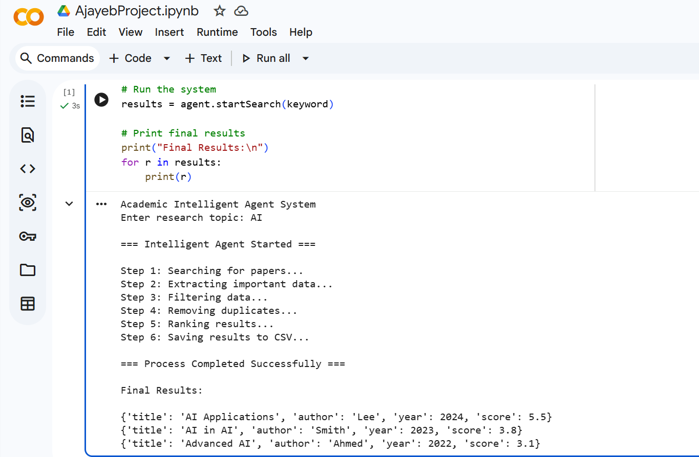

# Team Exercise Outcomes – Intelligent Academic Agent System

---

## 1. Project Overview

The Intelligent Academic Agent System is designed to automate the process of academic research by retrieving, processing, and organising research data based on user input.

The system follows a structured pipeline:

**Search → Extract → Process → Rank → Store**

The initial system design was developed collaboratively as part of a team project. This included defining the problem, identifying system requirements, selecting the Belief–Desire–Intention (BDI) model, and producing system diagrams. The implementation, testing, and evaluation were completed individually, demonstrating the ability to translate theoretical design into a working intelligent system.

---

## 2. System Architecture and Design

The system is designed using a modular architecture, where each component performs a specific function. This improves flexibility, scalability, and maintainability.

The main components include:

- Search Module  
- Data Extractor  
- Processing Module  
- Storage System  
- Agent Controller  

The Agent acts as the central controller, managing the flow of data between modules and ensuring that each step is executed in sequence.

---

## 3. System Design Diagrams

### Class Diagram

The class diagram illustrates the structural design of the system. It shows how different components are organised and how they interact with each other. The Agent class acts as the main controller, coordinating all other modules. Each module has a specific responsibility, which supports modular design and improves system maintainability.

---

### Sequence Diagram

The sequence diagram represents the workflow of the system. It shows how the agent processes user input step-by-step, starting from receiving a keyword, retrieving data, extracting relevant information, processing and ranking results, and finally storing the output. This reflects the automated behaviour of the intelligent agent.

---

## 4. BDI Model

The system is based on the Belief–Desire–Intention (BDI) model:

- **Beliefs:** knowledge about academic data and sources  
- **Desires:** retrieving relevant research papers  
- **Intentions:** executing the processing workflow  

This model enables the system to behave in a structured and goal-oriented way, supporting intelligent decision-making.

---

## 5. Implementation

The system was implemented using Python with an object-oriented programming approach.

### Key Components

- **Search Module:** simulates retrieving academic data  
- **Data Extractor:** extracts title, author, and year  
- **Processing Module:** removes duplicates and ranks results  
- **Storage System:** saves results in CSV format  
- **Agent Controller:** executes the full pipeline  

This modular implementation reflects good software design practices and supports scalability.

---

## 6. Intelligent Behaviour (Ranking Logic)

The system includes a ranking mechanism to simulate decision-making.

The score is calculated based on:
- Publication year (newer papers are prioritised)  
- Title length (used as a minor weighting factor)  

This allows the system to evaluate and prioritise results rather than simply retrieving data, demonstrating basic intelligent behaviour.

---

## 7. Evidence of Implementation

### System Output

This output demonstrates that the system successfully processes and ranks academic data based on relevance.

---

### Code Implementation

The system is implemented using modular classes, showing a structured and maintainable design.

---

### Data Storage

The processed results are stored in a CSV file, allowing users to access and analyse the data efficiently.

---

## 8. From Team Design to Individual Implementation

The team project focused on system design, including defining requirements, selecting the BDI model, and developing system diagrams. However, it remained largely conceptual.

My individual work extended this design by implementing a fully functional system. This highlighted the difference between theoretical design and practical execution.

During implementation:
- Real-world data integration was challenging  
- Simulated data was used instead  
- System behaviour was tested through execution  

This demonstrates the importance of applying theory in practice when developing intelligent systems.

---

## 9. Testing and Evaluation

The system was tested to ensure:

- Correct data extraction  
- Successful duplicate removal  
- Accurate ranking of results  
- Proper CSV file generation  

The results confirm that the system meets its functional requirements.

---

## 10. Critical Evaluation

### Strengths
- Modular and scalable architecture  
- Clear workflow and system structure  
- Implementation of intelligent behaviour through ranking  
- Efficient data processing and storage  

### Limitations
- Uses simulated data instead of real-world sources  
- Ranking logic is simple and not machine learning-based  
- Limited adaptability to dynamic environments  

---

## 11. Future Improvements

- Integrate real-world APIs (e.g., academic databases)  
- Improve ranking using machine learning techniques  
- Enhance adaptability of the agent  
- Expand system scalability  

---

## 12. Summary

The project demonstrates the successful development of an intelligent agent system. It combines theoretical concepts such as the BDI model with practical implementation, highlighting both strengths and limitations. This supports Learning Outcomes 2 and 3 by applying intelligent agent techniques to a real-world problem.
