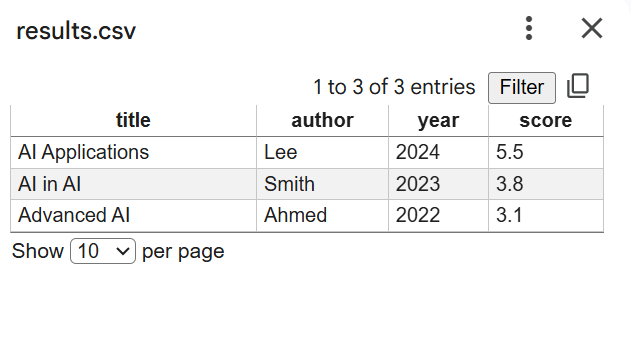

# Team Exercise Outcomes – Intelligent Academic Agent System

---

## 1. Project Overview

The Intelligent Academic Agent System is designed to automate the process of academic research by retrieving, processing, and organising research data based on user input.

The system follows a structured pipeline:

**Search → Extract → Process → Rank → Store**

The initial system design was developed collaboratively as part of a team project, where key elements such as requirements, architecture, and the Belief–Desire–Intention (BDI) model were defined. The implementation, testing, and evaluation were completed individually, demonstrating the ability to translate theoretical design into a working intelligent system.

---

## 2. System Architecture and Design

The system uses a modular architecture, where each component performs a specific function. This improves flexibility, scalability, and maintainability.

The main components are:

- Search Module  
- Data Extractor  
- Processing Module  
- Storage System  
- Agent Controller  

The Agent acts as the central controller, managing the workflow between modules.

### BDI Model

The system is based on the BDI model:

- **Beliefs:** knowledge about academic data  
- **Desires:** retrieving relevant research papers  
- **Intentions:** executing the processing workflow  

This model allows the system to behave in a goal-oriented and structured way.

---

## 3. Implementation

The system was implemented using Python with an object-oriented approach.

### Key Components

- **Search Module:** simulates retrieving academic data  
- **Data Extractor:** extracts title, author, and year  
- **Processing Module:** removes duplicates and ranks results  
- **Storage System:** saves results in CSV format  
- **Agent Controller:** executes the full pipeline  

---

## 4. Intelligent Behaviour (Ranking Logic)

The system includes a ranking mechanism to simulate decision-making.

The score is calculated based on:
- Publication year (newer papers are prioritised)  
- Title length (used as a minor weighting factor)  

This allows the system to evaluate and prioritise results rather than simply retrieving data.

---

## 5. Evidence of Implementation

### System Output

This output demonstrates that the system successfully processes and ranks data.

---

### Code Implementation

The system is implemented using modular classes, reflecting structured design and maintainability.

---

### Data Storage

The processed data is stored in a structured CSV file, allowing further analysis.

---

## 6. From Team Design to Individual Implementation

The team project focused on system design, including defining requirements, selecting the BDI model, and creating system diagrams. However, it remained largely conceptual.

My individual work extended this by implementing a fully functional system. This highlighted the difference between theoretical design and practical execution.

During implementation:
- Real-world data integration was challenging  
- Simulated data was used instead  
- System behaviour was tested through execution  

This demonstrates the importance of moving from design to implementation when developing intelligent systems.

---

## 7. Testing and Evaluation

The system was tested to ensure:

- Correct data extraction  
- Successful duplicate removal  
- Accurate ranking of results  
- Proper CSV file generation  

The results confirmed that the system meets its functional requirements.

---

## 8. Critical Evaluation

### Strengths
- Clear modular architecture  
- Structured workflow  
- Implementation of intelligent behaviour through ranking  
- Efficient data processing and storage  

### Limitations
- Uses simulated data instead of real-world sources  
- Ranking logic is simple and not machine learning-based  
- Limited adaptability to dynamic environments  

---

## 9. Future Improvements

- Integrate real-world APIs (e.g., academic databases)  
- Improve ranking using machine learning techniques  
- Enhance adaptability of the agent  
- Expand system scalability  

---

## 10. Summary

The project demonstrates the successful development of an intelligent agent system. It combines theoretical concepts such as the BDI model with practical implementation, highlighting both strengths and limitations. This supports Learning Outcomes 2 and 3 by applying intelligent agent techniques to a real-world problem.
